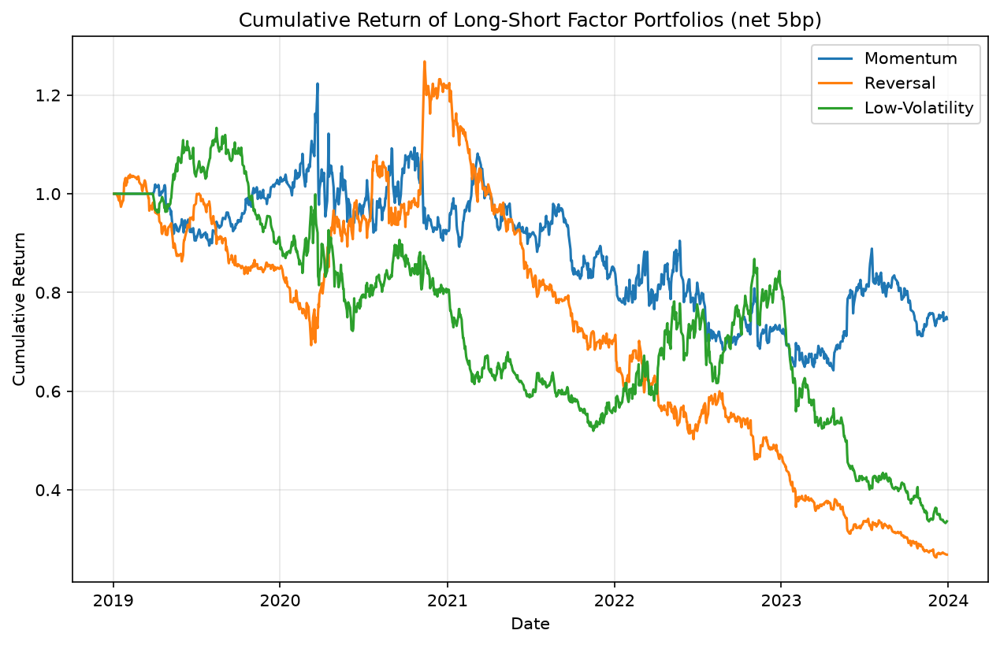
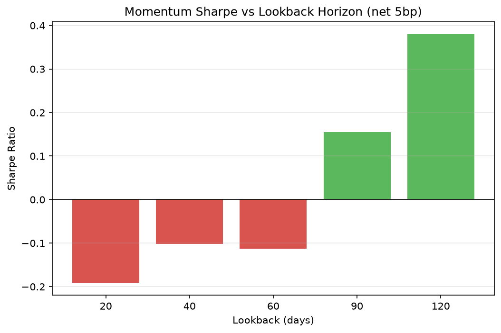

# Alpha Signal Backtesting Framework

A long-short equity backtesting framework for evaluating quantitative alpha
factors, with performance metrics, transaction-cost modelling, and
parameter-sensitivity analysis.

## Overview
The framework ranks a universe of US large-cap stocks each day by a factor
signal, goes long the top 20% and short the bottom 20% (equal-weighted), and
evaluates the resulting long-short portfolio net of transaction costs.

- **Universe:** 30 US large-cap stocks
- **Period:** 2019–2024 (daily)
- **Factors:** Momentum, Short-term Reversal, Low-Volatility
- **Metrics:** Annualised return/vol, Sharpe, max drawdown, turnover

## Results (net of 5bp transaction cost)

| Factor          | Sharpe | Max Drawdown | Avg Turnover |
|-----------------|--------|--------------|--------------|
| Momentum        | -0.11  | -0.48        | 0.44         |
| Reversal        | -0.98  | -0.79        | 1.41         |
| Low-Volatility  | -0.68  | -0.71        | 0.15         |



## Key Findings
- **Momentum is highly sensitive to lookback horizon.** Sharpe is negative at
  short horizons (20–60 days) but turns positive at longer horizons, reaching
  **0.38 at a 120-day lookback** — consistent with the classic medium-term
  momentum effect (Jegadeesh & Titman, 1993).
- **Turnover and transaction costs matter.** Reversal has the highest turnover
  (1.4/day); after 5bp costs its performance deteriorates sharply, showing that
  a signal's cost profile is as important as its raw predictive power.

| Momentum lookback | 20 | 40 | 60 | 90 | 120 |
|-------------------|-----|-----|-----|-----|-----|
| Sharpe            | -0.19 | -0.10 | -0.11 | 0.16 | 0.38 |

## How to Run
```bash
pip install yfinance pandas numpy matplotlib
python main.py
